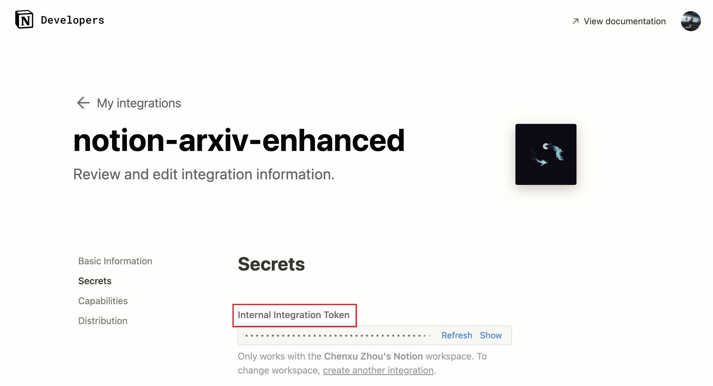

# Notion arXiv Enhancer

This project is my attempt at automating work in Notion. There may be some bugs, but if it's helpful to you, please give me a star.

## Table of contents

<!--toc:start-->
- [Notion arXiv Enhancer](#notion-arxiv-enhancer)
  - [Table of contents](#table-of-contents)
  - [About this project](#about-this-project)
  - [Features](#features)
  - [Install & Use](#install-use)
  - [Demo](#demo)
  - [FAQ](#faq)
<!--toc:end-->

## About this project

The purpose of this project is to automate the acquisition of related information about papers on arXiv and integrate it into Notion.

## Features

- The input format is concise, efficient, and fast.
- Update the author information of each page automatically.

## Install & Use

1. Install the necessary Python modules.

  ```sh
  pip install -r requirements.txt
  ```

2. Create a new Notion integration in this [page](https://www.notion.com/my-integrations), once you have created your integration, you will be given an integration token. This token is used to authenticate your requests to the Notion API. You can also change the token *Capabilities* as you like.
  

3. Add the token saved in **Step 2.** to [config.yaml](./config.yaml), the token should to in the `NOTION_TOKEN` field, please do not remove the double quotes, as this is a string.

4. Get the database id from Notion, you can get the id follow the instruction below:
  
  Then copy the link to anywhere you like, the **string end up with '?v='** is the database id we need. Lastly, connect the database to the Notion integration created in **Step 1.**(This is very important, otherwise we cannot access the database.)
  

5. Add the database id copied in **Step 4.** to [config.yaml](./config.yaml), the database id should to in the `DATABASE_ID` field, please do not remove the double quotes, as this is a string.

6. Add the database property name into the [config.yaml](./config.yaml), add the property required(Title, URL, Author) in the `PROPERTY` field
  
  So finally your config file should be like this:

  ```
NOTION_TOKEN: "secret_xxx"
DATABASE_ID: "xxx"
PROPERTY:
    title: "论文Title"
    url: "论文链接"
    author: "论文作者"
  ```

## Demo

## FAQ

Q: Error - arxiv.arxiv.HTTPError: Page request resulted in HTTP 502

A: A non-200 status encountered while fetching a page of results, just retry it.

Q: Error - httpx.ConnectError: EOF occurred in violation of protocol

A: This error is caused by the proxier, check out your proxier and retry it.
