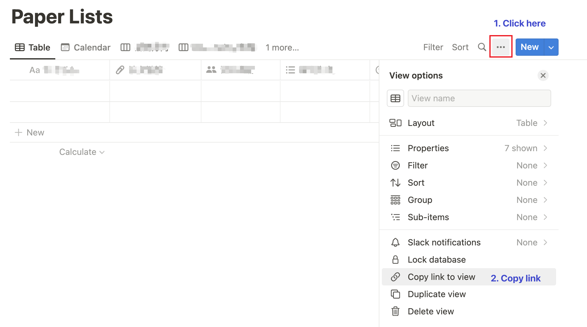
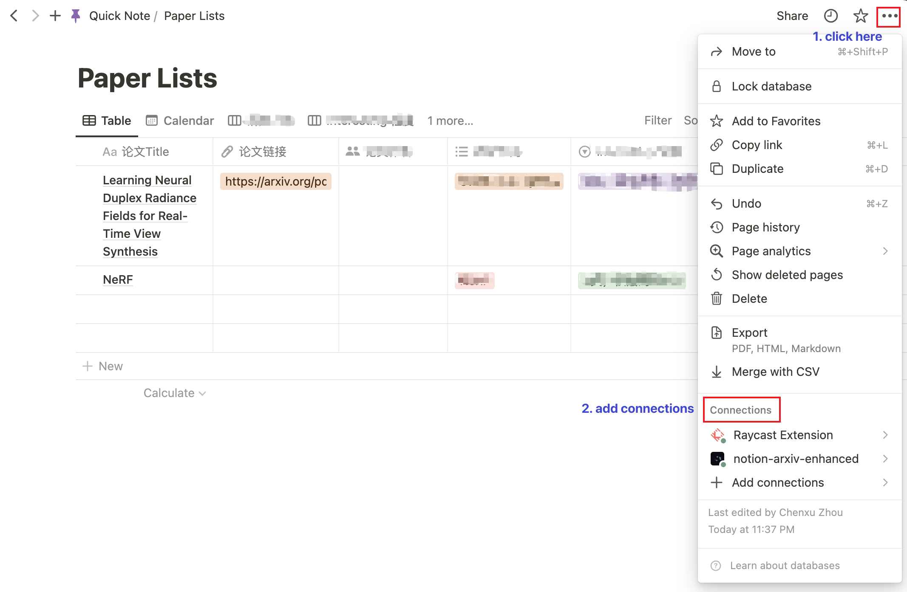

# Notion arXiv Enhancer

This project is my attempt at automating work in Notion. There may be some bugs, but if it's helpful to you, please give me a star. ⭐️

> If you meet any problems during use or would like to suggest new features to enhance this project, please feel free to [create an issue](https://github.com/Xuer04/notion-arxiv-enhancer/issues/new). 😁

## Table of contents

<!--toc:start-->
- [Notion arXiv Enhancer](#notion-arxiv-enhancer)
  - [Table of contents](#table-of-contents)
  - [About this project](#about-this-project)
  - [Features](#features)
  - [Install & Use](#install-use)
  - [Demo](#demo)
  - [Acknowledgment](#acknowledgment)
  - [FAQ](#faq)
<!--toc:end-->

## About this project

The purpose of this project is to automate the acquisition of related information about papers on arXiv and integrate it into Notion.

## Features

- The input format is concise, efficient, and fast.
- Update the author information of each page automatically.
- 💥 Add a new feature according to this [issue](https://github.com/Xuer04/notion-arxiv-enhancer/issues/1). Now we can automatically fetch updated arXiv paper links daily and cache them for download locally, just add a parameter `auto_fetch` when running the script. The arXiv search options can be found in [config.yaml](./config.yaml).

## Install & Use

1. Install the necessary Python modules.

  ```sh
  pip install -r requirements.txt
  ```

2. Create a new Notion integration in this [page](https://www.notion.com/my-integrations), once you have created your integration, you will be given an integration token. This token is used to authenticate your requests to the Notion API. You can also change the token *Capabilities* as you like.
  

3. Add the token saved in **Step 2.** to [config.yaml](./config.yaml), the token should be in the `NOTION_TOKEN` field, please do not remove the double quotes, as this is a string.

4. Get the database id from Notion, you can get the id follow the instruction below:
  
  Then copy the link to anywhere you like, the **string end up with '?v='** is the database id we need. Lastly, connect the database to the Notion integration created in **Step 1.**(This is very important, otherwise we cannot access the database.)
  

5. Add the database id copied in **Step 4.** to [config.yaml](./config.yaml), the database id should be in the `DATABASE_ID` field, please do not remove the double quotes, as this is a string.

6. Add the database property name into the [config.yaml](./config.yaml), add the property required(Title, URL, Author) in the `PROPERTY` field.
  
  So finally your config file should be like this:

  ```
NOTION_TOKEN: "xxx"
DATABASE_ID: "xxx"
PROPERTY: # change the property name according to your database.
    title: "论文Title"
    url: "论文链接"
    author: "论文作者"
  ```

7. If you want to automatically fetch the arXiv paper, just run the command below:

  ```sh
  python main.py --auto_fetch
  ```

  > You can also check the arXiv options in [config.yaml](./config.yaml).

## Demo


## Acknowledgment

💗 Thanks for these great works:

- [arxiv](https://github.com/lukasschwab/arxiv.py)
- [notion-py](https://github.com/jamalex/notion-py)
- [notion-sdk-py](https://github.com/ramnes/notion-sdk-py)

## FAQ

Q: Error - arxiv.arxiv.HTTPError: Page request resulted in HTTP 502

A: A non-200 status encountered while fetching a page of results, just retry it.

Q: Error - httpx.ConnectError: EOF occurred in violation of protocol

A: This error is caused by the proxier, check out your proxier and retry it.
